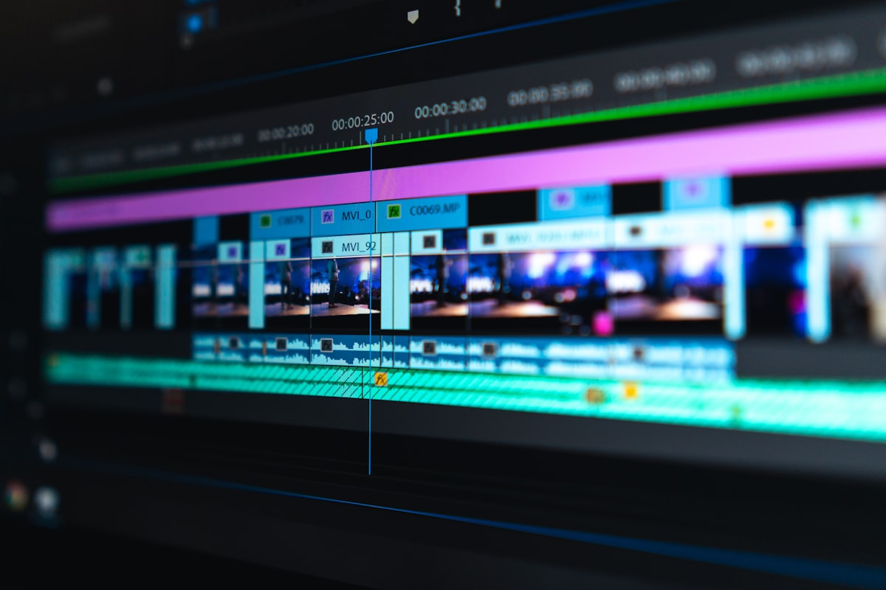

<div align="center">

# YT2

**Local YouTube video summarizer.**

Paste a URL, get an HTML page with keyframe screenshots and AI summaries. Runs entirely on your machine.

<br>



<sub>Photo by <a href="https://unsplash.com/@jakobowens1">Jakob Owens</a> on Unsplash</sub>

</div>

---

```
URL → yt-dlp → Whisper → PySceneDetect → FFmpeg → Ollama → HTML
```

Downloads the video, transcribes it, detects scene changes, pulls a keyframe at each cut, summarizes each section through a local LLM, and renders a self-contained HTML file with everything embedded. Also includes a shorts creator for vertical clips with word-level captions, and a GUI if you don't want the CLI.

## Setup

Requires [Python 3.10+](https://python.org), [yt-dlp](https://github.com/yt-dlp/yt-dlp), [FFmpeg](https://ffmpeg.org/download.html), and [Ollama](https://ollama.com).

```bash
ollama pull mistral
setup.bat
run.bat https://www.youtube.com/watch?v=VIDEO_ID --open
```

## Options

```
python yt2.py URL [OPTIONS]

  --model TEXT              Ollama model (default: mistral)
  --whisper-model TEXT      tiny.en / base.en / small.en / medium.en / large-v3
  --scene-threshold FLOAT   Scene sensitivity (default: 27.0)
  --no-cache                Force re-process
  --open                    Open result in browser
```

## License

MIT
